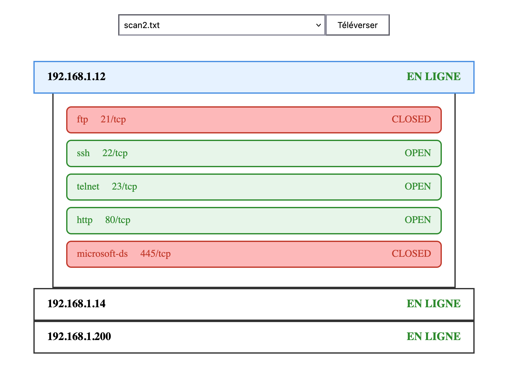

# nmap_analyser
Analyser des fichiers de scan nmap

Uploadez un ou plusieurs fichiers, les résultats s'affichent sous forme de liste. Pour chaque IP ouverte, vous pouvez voir les détails des services présents. 



## Installation (Linux)

```bash
# git clone le projet
git clone https://github.com/HubSeaLon/nmap_analyser.git

# Création environnement virtuel
python3 -m venv venv
source venv/bin/activate

# Installation dépendances (dans répertoire projet)
pip3 install -r requirements.txt

# Lancer le projet
Flask run
```


